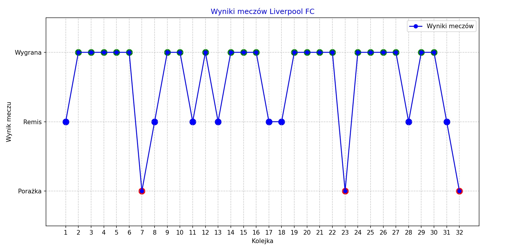

<h1>Football App</h1>

W ramach aplikacji po wybraniu dowolnej drużyny piłkarskiej z ligi angielskiej (numer_id oraz nazwa klubu) dostaniemy informację kiedy rozegrał się mecz każdej kolejki oraz zostanie przedstawiony wykres ukazujący na przestrzeni rozegranych kolejek formę drużyny (wygrana, remis, przegrana). Program ten pozwala na prostą analizę formy danej drużyny.

Wykorzystano technologie takie jak:
  <ul>
      <li> Python jak główny język aplikacji
      <li> Footbal-data Api jako bazę danych: https://www.football-data.org/ (w wersji podstawowej free)
      <li> Biblioteki do obsługi danych takie jak matplotlib
  </ul>

<h2>Przykładowe działanie aplikacji:</h2>
 

<h2>Do zrobienia:</h2>
<ul>
  <li>Możliwość analizy wielu klubów naraz i dokonania porównania</li>
  <li>Rozbudowa o większą ilość lig poza ligą angielską</li>
  <li>Dodanie nowych opcji typu widok tabeli z punktacją wszystkich klubów</li>
  <li>Dodanie interfejsu graficznego użytkownika w celu ułatwienia użytkowania aplikacji</li>
</ul>

<h2>Zrobione:</h2>
<ul>
  <li>Dodanie łatwiejszej opcji wyboru klubu do analizy (docelowo wpisanie nazwy klubu liverpool ma być traktowane jako wpisanie id = 64 oraz Liverpool FC)</li>
  <li>Łatwiejsze wydobycie informacji jaki zespół ma jakie id w danym API</li>
</ul>

<h1>Football App</h1>.

As part of the application, after selecting any football team from the English league (number_id and club name) we will get information when the match of each round was played and a graph will be presented showing over the course of the played rounds the form of the team (win, draw, loss). This program allows a simple analysis of the form of a given team.
.

Technologies used include:
 <ul>
 <li> Python as the main language of the application
 <li> Footbal-data Api as the database: https://www.football-data.org/ (in the basic version free)
 <li> Data handling libraries such as matplotlib
 </ul>

<h2>To do:</h2>.
<ul>.
 <li>Ability to analyze multiple clubs at once and make comparisons</li>.
 <li>Extension to include more leagues outside the English league</li>.
 <li>Add new options like a table view with scores of all clubs</li>.
 <li>Add a graphical user interface to make the application easier to use</li>.
</ul>

<h2>Done:</h2>.
<ul>
 <li>Add an easier option to select a club for analysis (eventually entering the club name liverpool is to be treated as entering id = 64 and Liverpool FC)</li>.
 <li>Easier extraction of information what team has what id in a given API</li>.
</ul>

